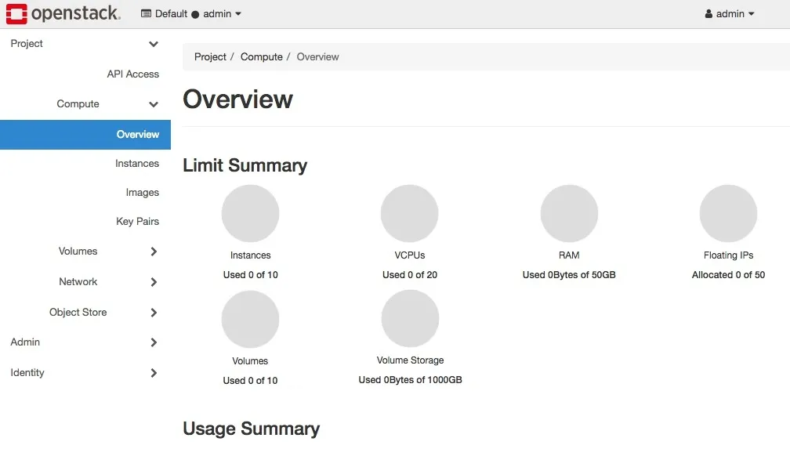

# Cloud-init

Cloud-init est un outil open source utilisé pour l'initialisation et la configuration automatique des machines virtuelles lors de leur premier démarrage dans des environnements cloud. Il permet de personnaliser les instances (utilisateurs, clés SSH, paquets à installer, scripts à exécuter, etc.) à partir de métadonnées fournies par le fournisseur cloud ou des fichiers de configuration. Cloud-init est largement supporté par les principales plateformes cloud comme AWS, Azure, Google Cloud et OpenStack.

- **[Amazon Web Services (AWS)](https://aws.amazon.com/fr/)** : Plateforme cloud leader offrant une large gamme de services d'infrastructure et de déploiement.
- **[Microsoft Azure](https://azure.microsoft.com/fr-fr/)** : Solution cloud de Microsoft, intégrée à de nombreux outils et services d'entreprise.
- **[Google Cloud Platform (GCP)](https://cloud.google.com/)** : Plateforme cloud de Google, reconnue pour ses services de données et d'intelligence artificielle.
- **[OpenStack](https://www.openstack.org/)** : Solution open source permettant de créer et gérer des clouds privés ou publics.

## Bref historique

Cloud-init a été créé en 2008 par Canonical pour répondre aux besoins croissants d'automatisation dans les environnements cloud, notamment avec le lancement d'Ubuntu sur Amazon EC2. Initialement développé pour Ubuntu, il a rapidement gagné en popularité et a été adopté par d'autres distributions Linux. Au fil des années, cloud-init est devenu la solution standard pour l'initialisation des instances cloud, bénéficiant d'une large communauté et d'un développement actif.


## Avantages de cloud-init

- **Agnostique vis-à-vis du cloud** : Cloud-init fonctionne avec la plupart des fournisseurs de cloud et sur de nombreuses distributions Linux, ce qui facilite la portabilité et la standardisation des déploiements.
- **Pas d'agent persistant** : Contrairement à des solutions comme Puppet, cloud-init n'installe pas d'agent qui tourne en continu sur la machine. Il s'exécute uniquement lors du démarrage initial, ce qui réduit la surface d'attaque et la consommation de ressources.
- **Pas besoin d'utilisateur dédié** : À la différence d'Ansible qui nécessite souvent un utilisateur dédié pour l'exécution des tâches, cloud-init s'exécute avec les privilèges nécessaires dès la phase d'initialisation, simplifiant la gestion des accès et des permissions.
- **Automatisation complète dès le boot** : Permet de configurer entièrement une instance (réseau, utilisateurs, paquets, scripts) dès son premier démarrage, sans intervention manuelle.
- **Intégration native avec les métadonnées cloud** : Exploite directement les métadonnées fournies par le cloud pour personnaliser chaque instance de façon dynamique.

:::tip
Dans la littérature, les fichiers de configuration sont appelés **dictonnaires**. 
:::

## Exemple simple : création d'un utilisateur

Voici un exemple minimal de fichier cloud-init en YAML qui crée un utilisateur `alice` avec un mot de passe hashé :

```yaml
#cloud-config

groups:
    - alice
users:
    - name: alice
      homedir: /home/alice
      gecos: Alice Example
      sudo: ALL=(ALL) NOPASSWD:ALL
      shell: /bin/bash
      lock_passwd: false
      passwd: "$6$QwEr[cut]]w8kYw1"
      primary_group: alice
```

Dans cet exemple, le champ `passwd` contient le mot de passe hashé de l'utilisateur. Cloud-init attend un mot de passe au format hashé (par exemple SHA-512).

La ligne `#cloud-config` placée en début de fichier indique explicitement à cloud-init que ce document est un **user-data** de type *cloud-config*.

### Qu'est-ce que l'user-data ?

L'**user-data** est un mécanisme standard dans les environnements cloud qui permet de passer des données de configuration à une instance lors de sa création. Ces données sont mises à disposition de l'instance via un service de métadonnées et peuvent contenir :

- des scripts shell à exécuter;
- des fichiers de configuration;
- des données de personnalisation;

### Pourquoi `#cloud-config` ?

Cloud-init supporte plusieurs formats d'user-data :

1. **Scripts shell** : commencent par `#!/bin/bash` ou `#!/bin/sh`
2. **Cloud-config (YAML)** : commencent par `#cloud-config`
3. **Scripts Python** : commencent par `#!/usr/bin/python`
4. **Données binaires** : pour des fichiers plus complexes

La directive `#cloud-config` permet à cloud-init de :
- **Identifier le format** : Savoir qu'il s'agit d'un fichier YAML structuré
- **Choisir le bon parser** : Utiliser l'analyseur YAML plutôt que l'exécuteur de scripts
- **Appliquer la configuration** : Interpréter les directives comme des modules cloud-init

Sans cette mention, le fichier pourrait être ignoré ou mal interprété comme un simple script shell.

### Comment générer un mot de passe hashé

Sous Linux, vous pouvez générer un mot de passe hashé compatible avec cloud-init en utilisant la commande suivante :

```bash
mkpasswd --method=SHA-512
```

## Environnement de travail 

**DevStack** est un projet basé sur OpenStack qui permet de démarrer simplement un cluster Openstack.

https://docs.openstack.org/devstack/latest/

DevStack est un ensemble de scripts destiné à faciliter le déploiement rapide d'un environnement OpenStack pour le développement et les tests. Il permet aux développeurs et aux contributeurs de mettre en place une instance OpenStack complète sur une machine virtuelle ou physique, en automatisant l'installation et la configuration des différents services OpenStack.

### Installation de DevStack

- installer un _user_ spécifique

    ```bash
    useradd -s /bin/bash -d /opt/stack -m stack
    ```

- cloner le dépôt DevStack :
    ```bash
    git clone https://opendev.org/openstack/devstack.git
    ```
    
- se placer dans le répertoire DevStack :
    ```bash
    cd devstack
    ```
    
- créer un fichier de configuration local (`local.conf`) pour personnaliser l'installation.

    Par exemple : 

    ```bash 
    [[local|localrc]]
    ADMIN_PASSWORD=secret
    DATABASE_PASSWORD=\$ADMIN_PASSWORD
    RABBIT_PASSWORD=\$ADMIN_PASSWORD
    SERVICE_PASSWORD=\$ADMIN_PASSWORD
    ```

- Lancer le script d'installation :
    ```bash
    ./stack.sh
    ```



https://docs.openstack.org/devstack/latest/  
https://www.redhat.com/en/blog/get-started-openstack-devstack

## Création d'images cloud et utilisation des fichiers cloud-config

Le fichier YAML que nous avons créé précédemment peut être utilisé de plusieurs façons :

- en console
    ```bash
    openstack server create \
        --image ubuntu-20.04 \
        --flavor m1.small \
        --user-data mon-cloud-config.yaml \
        mon-serveur
    ```

@fixme à vérifier

- via l'interface web


Vérifiez ensuite que la configuration a été appliquée :

```bash
# Se connecter à l'instance
ssh alice@<IP_INSTANCE>

# Vérifier les logs cloud-init
sudo cat /var/log/cloud-init.log
sudo cloud-init status
```

## Exemple un dictonnaire un peu plus dynamique

Voici un exemple de fichier qui installe un serveur web et _cowsay_. _cowsay_ nous dira quel serveur est installé. 

```yaml
#cloud-config

groups:
    - alice
users:
    - name: alice
      homedir: /home/alice
      gecos: Alice Example
      sudo: ALL=(ALL) NOPASSWD:ALL
      shell: /bin/bash
      lock_passwd: false
      passwd: "$6$QwEr[cut]]w8kYw1"
      primary_group: alice

package_update: true
package_upgrade: true
packages:
    - vim
    - cowsay
    - net-tools
    - apache2

runcmd:
    - cowsay "$(dpkg -l| grep apache)" > /etc/motd
```

### Jinja2

Cloud-init prend en charge le **templating Jinja2** pour rendre les fichiers de configuration plus dynamiques et adaptatifs. Jinja2 est un moteur de templates populaire en Python qui permet d'insérer des variables, des boucles et des conditions dans vos fichiers YAML. Cela facilite la personnalisation avancée des instances en fonction des métadonnées ou des paramètres fournis lors du déploiement.

Pour activer Jinja2 dans un fichier cloud-init, il suffit d'ajouter la directive suivante en début de fichier :

```yaml
#cloud-config
template: jinja
```

Vous pouvez ensuite utiliser la syntaxe Jinja2, par exemple :

```yaml
#cloud-config
template: jinja

users:
    - name: {{ fqdn | default("utilisateur") }}
      shell: /bin/bash
```

Cloud-init remplacera automatiquement les variables Jinja2 par les valeurs appropriées lors de l'initialisation de l'instance. Cela permet de générer des configurations adaptées à chaque machine, sans avoir à maintenir plusieurs fichiers statiques.

### Métadonnées fournies par OpenStack

OpenStack met à disposition de chaque instance un service de **métadonnées** accessible via le réseau interne. Ces métadonnées contiennent des informations dynamiques sur l'instance, telles que l'ID, le nom, les clés SSH, ou encore la distribution Linux utilisée (`vl.distro`, par exemple). Cloud-init exploite ces métadonnées pour adapter automatiquement la configuration de l'instance lors du démarrage.

Si nous reprenons l'exemple, nous pouvons adapter le fichier _cloud-init_ à plusieur distribution différentes. Par ex. Debian appelle son paquet Apache2, `apache2` tandis que Fedora, l'appelle `http`. 

```yaml
#cloud-config

groups:
    - alice
users:
    - name: alice
      homedir: /home/alice
      gecos: Alice Example
      sudo: ALL=(ALL) NOPASSWD:ALL
      shell: /bin/bash
      lock_passwd: false
      passwd: "$6$QwEr[cut]]w8kYw1"
      primary_group: alice

package_update: true
package_upgrade: true
packages:
    - vim
    - cowsay
    - net-tools

    - http

    - apache2


runcmd:

    - cowsay "$(rpm -qi | grep httpd)" > /etc/motd

    - cowsay "$(dpkg -l| grep apache)" > /etc/motd

```

:::info
Il existe encore d'autres modules comme : `apt`, `write_files`…
:::
