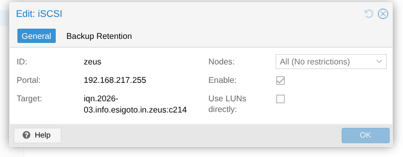

# iSCSI

**iSCSI** (_Internet Small Computer System Interface_) est un protocole de stockage qui utilise TCP/IP pour les communications entre les clients (serveurs MS Windows / Linux) et les serveurs que sont les baies de stockages.

Le stockage iSCSI est un stockage de type **SAN** (_Storage Area Network_) — partage de stockage de type bloc — contrairement au partage de fichiers (genre NFS/Samba/CIFS) qui est appelé **NAS** (_Network Attached Storage_). Dans le cas du iSCSI et des configuration SAN en général, le partage se fait au niveau d'un disque — **LUN** (_Logical Unit Number_) — et pas de fichiers ou répertoires.

Le nom iSCSI vient de la méthode utilisée pour accéder aux disques distants, qui transporte des commandes SCSI sur un réseau TCP/IP classique. Ceci permet d'utiliser du stockage distant et (potentiellement) partagé sans nécessiter une infrastructure dédiée et coûteuse en _fiber channel_ (FC).

:::info

**Fiber Channel** (FC) est un protocole de communication haute vitesse dédié au stockage, utilisant une infrastructure réseau spécialisée. Contrairement à iSCSI qui s'appuie sur TCP/IP standard, FC offre des performances supérieures et une latence réduite, mais nécessite un investissement matériel plus important en équipements dédiés.
:::

Le port par défaut est le **TCP 3620**

| Caractéristique | iSCSI | NFS | Samba/CIFS |
|---|---|---|---|
| **Type de partage** | Bloc (SAN) | Fichiers (NAS) | Fichiers (NAS) |
| **Ce que voit le client** | Disque brut (LUN) — `/dev/sdX` | Système de fichiers monté — `/mnt/share` | Partages réseau monté — `/mnt/smbshare`|
| **Filesystem** | Géré par le client (`ext4`…)| Géré par le serveur | Géré par le serveur |
| **Cas d'usage** | Virtualisation, bases de données, haute performance | Partage générique Unix/Linux | Partage générique Windows/Linux |
| **Ports** | TCP 3620 | TCP/UDP 111, 2049 | TCP 139, 445 |

# Les composants

Les éléments présents dans une infrastructure iSCSI sont :

- la **target** qui est le périphérique de stockage qui partage l'espace disque et;
- l'**initiator**, le composant software qui tourne sur le serveur qui doit accéder au stockage.  Dans notre cas, ce sera le serveur Proxmox;
- un identifiant unique, **IQN** (_iSCSI Qualified Name_) de la forme : `iqn.AAAA-MM-domain:identifier`;
- un **LUN** (_Logical Unit Number_), un disque exposé à travers iSCSI dans un point d'accès **TPG** (_Target Portal Group_) de la forme : `IP:port`;
- un **backstore** qui représente le disque là ou le LUN représente plutôt la baie logique (une partition, un volume LVM…);

:::info
Il existe un composant spécifique qui est appelé passerelle iSCSI, en général du hardware dédié, qui permet de donner accès à des baies de stockage FC qui ne sont pas capable de communiquer en iSCSI nativement. C'est un équipement qui fait la conversion entre iSCSI et FC.
:::

# Configuration

Il y a plusieurs manières de mettre en œuvre un SAN sous linux : LIO (_linux-IO target_), TrueNAS…

## LIO (_linux-IO target_)

**LIO** (_linux-IO target_) est le framework cible iSCSI intégré au noyau, piloté par la commande `targetcli`. Il permet de configurer une machine comme **target**.

::: warning 
`targetcli-fb` est le _package_ qui va bien et `targetcli` la commande associée.
::: 

### Le serveur

Préparer le stockage, c'est, une fois la commande `targetcli` lancée :  

- créer un ou plusieurs **backstores**

    ```bash
    /> cd /backstores/block
    /backstores/block> create <lun name> /dev/vdb
    ```

    :::info 
    Ils existent de 2 types : _block_ et _fileio_. Nous utilisons le type _block_. 
    :::

- créer une ou plusieurs **target**

    ```bash
    /> cd /iscsi
    /iscsi> create iqn.2026-03.zeus:target01
    ```

- créer des ACL pour autoriser un ou plusieurs **initiator**

    ```bash
    /> cd /iscsi/iqn.2026-03.zeus:target01/tpg1/acls
    /iscsi/.../acls> create iqn.2026-03.zeus:<login>
    ```

- associer le ou les backstores à la target

    ```bash
    /> cd /iscsi/iqn.2026-03.zeus:target01/tpg1/luns
    /iscsi/iqn.20...mes/tpg1/luns create /backstores/block/<lun name>
    ```

- vérifier et sauvegarder 

    ```bash
    /> ls /
    /> saveconfig
    /> exit
    ```

Le reste se fait ensuite du côté des clients.

### Un client

C'est l'**initiator** le client qui se connecte à la target pour utiliser les disques. Sous linux — et donc également pour Proxmox — c'est le paquet `open-iscsi` qui s'en charge. 

:::tip 
Sur une machine Proxmox le paquet est déjà installé mais on peut le vérifier. Dans la foulée, installer le paquet `lsscsi` s'il ne l'est pas. 
:::

- configurer le nom de l'initiator dans le fichier `/etc/iscsi/initiatorname.iscsi`. Ce nom **correspond exactement** à celui défini plus haut `iqn.2026-03.zeus:target01` et correspondant à une ACL sur la _target_.

    ```conf
    InitatorName=iqn.2026-03.zeus:target01
    ```

- donner ses _credentials_. Dans le fichier `/etc/iscsi/iscsid.conf`, chercher les lignes suivantes et les mettre à jour : 

    ```bash 
    node.session.auth.authmethod = CHAP
    node.session.auth.username = <login>
    node.session.auth.password = <password>
    ```

Il est possible de vérifier (la connexion et) la liste des ressources sur la _target_ : 

- lister les ressources disponibles sur la _target_

    ```bash 
    iscsiadm -m discovery -t sendtargets -p <IP>
    ```

- se connecter 

    ```bash
    iscsiadm -m node \
        -T iqn.2026-03.zeus:target01 \
        -p <IP> --login
    ```

- lister les sessions actives

    ```bash 
    iscsiadm -m session -o show
    ```

- vérifier les disques disponibles (LUN _logic unit_)

    ```bash
    lsscsi
    ```


Le reste pourra se faire à partir de l'interface de Proxmox en ajoutant un stockage iSCSI.



TODO vérifier sur proxmox.

## TrueNAS

TODO
- à voir si ça correspond à nos besoins. j'ai (pbt) l'impression que c'est un peu l'artillerie lourde
