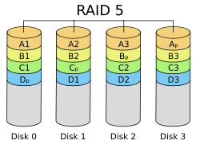

# RAID

## Qu'est-ce qu'un RAID ?

**RAID** signifie *Redundant Array of Independent Disks* (groupe redondant de disques indépendants). Il s'agit d'une technologie de virtualisation du stockage qui combine plusieurs disques durs physiques en une seule unité logique.

Les objectifs principaux du RAID sont :

- **la redondance** : protéger les données contre la perte en cas de défaillance d'un disque
- **les performances** : améliorer la vitesse de lecture/écriture en répartissant les données sur plusieurs disques
- **la capacité** : combiner l'espace de plusieurs disques pour créer un volume plus grand

:::info
Le RAID n'est **pas une sauvegarde** ! Il protège contre la défaillance matérielle d'un disque, mais pas contre la suppression accidentelle, la corruption de données ou les _ransomwares_. Une stratégie de sauvegarde complète reste indispensable.
:::

## Les différents niveaux RAID

### RAID 0 - Fragmentation sur plusieurs supports 

ou **volume agrégé par bandes _striping_**

<div class="float-right">

  
_Source Wikipedia_

</div>

Le RAID 0 répartit les données sur plusieurs disques sans aucune redondance.

Usage : applications nécessitant des performances élevées où la perte de données n'est pas critique (cache, données temporaires, traitement vidéo).


| Avantages | Inconvénients |
|-----------|---------------|
| Performances maximales en lecture et écriture | Aucune tolérance aux pannes (la défaillance d'un seul disque entraîne la perte de toutes les données) |
| Utilisation de 100% de la capacité totale des disques | Fiabilité diminuée (plus de disques = plus de risques de panne) |


|**Capacité utile**
|--
| N × taille du plus petit disque (où N = nombre de disques)

### RAID 1 - Miroir (*Mirroring*)

<div class="float-right">


_Source Wikipedia_

</div>

Le RAID 1 duplique (met en miroir) les données sur deux disques ou plus.

Usage : systèmes nécessitant une haute disponibilité (serveurs critiques, bases de données de petite taille, systèmes d'exploitation).


| Avantages | Inconvénients |
|-----------|---------------|
| Haute disponibilité et tolérance aux pannes | Capacité utile réduite de moitié |
| Performances en lecture améliorées | Performances d'écriture identiques à un disque seul |
| Reconstruction rapide en cas de panne | |


|**Capacité utile**
|--
|Taille du plus petit disque

### RAID 5 - Agrégation avec parité distribuée

<div class="float-right">



</div>

Le RAID 5 répartit les données et la parité sur tous les disques. La parité permet de reconstruire les données en cas de défaillance d'un disque.

Usage : serveurs de fichiers, applications d'entreprise nécessitant un bon équilibre entre performances et protection.


| Avantages | Inconvénients |
|-----------|---------------|
| Bon compromis entre performance, capacité et sécurité | Performances d'écriture réduites (calcul de parité) |
| Bonne performance en lecture | Reconstruction lente en cas de panne |
| Tolérance à la panne d'un disque | Risque élevé lors de la reconstruction (charge importante sur les disques restants) |

|**Capacité utile**
|--
| (N-1) × taille du plus petit disque

:::warning
Le RAID 5 est considéré comme « obsolète » pour les disques de grande capacité (> 1TB) car le temps de reconstruction est très long et augmente le risque d'une seconde panne pendant la reconstruction.
:::

### RAID 6 - Agrégation avec double parité

Le RAID 6 est similaire au RAID 5 mais avec deux blocs de parité, permettant de tolérer la défaillance de deux disques simultanément.

Usage : environnements nécessitant une haute disponibilité avec des disques de grande capacité.


| Avantages | Inconvénients |
|-----------|---------------|
| Tolérance à la panne de deux disques | Performances d'écriture encore plus réduites (double calcul de parité) |
| Meilleure protection que RAID 5 | Nécessite plus de disques |


|**Capacité utile**
|--
|(N-2) × taille du plus petit disque

### RAID 10 (1+0) - Miroir d'agrégats

<div class="float-right">


_Source Data recovery specialists_

</div>

Le RAID 10 combine RAID 1 et RAID 0 : les données sont d'abord mises en miroir (RAID 1), puis les miroirs sont agrégés (RAID 0).

Usage : bases de données, serveurs nécessitant hautes performances et haute disponibilité.


| Avantages | Inconvénients |
|-----------|---------------|
| Excellentes performances en lecture et écriture | Coût élevé (50% de capacité perdue) |
| Tolérance aux pannes (au moins un disque par miroir peut tomber en panne) | Nécessite un nombre pair de disques |
| Reconstruction rapide | |


|**Capacité utile**
|--
| (N/2) × taille du plus petit disque

:::info
**RAID 2, 3 et 4** : Ces niveaux RAID ont existé historiquement mais sont aujourd'hui obsolètes et rarement utilisés. 

Le RAID 2 utilisait un code de Hamming, le RAID 3 une parité dédiée sur un seul disque avec _striping_ au niveau octet, et le RAID 4 une parité dédiée avec _striping_ au niveau bloc. Ils ont été remplacés par RAID 5 et 6 qui offrent de meilleures performances.
:::


## Contrôleur RAID (*RAID Controller*)

Un contrôleur RAID est un périphérique matériel ou logiciel qui gère les opérations RAID.

### RAID matériel (*Hardware RAID*)


_Exemple de carte RAID : PERC H965e_

Le RAID matériel est une carte ou un composant affecté à la gestion des opérations. Le contrôleur RAID peut être interne à l'unité centrale (carte d'extension) ou déporté dans une baie de stockage.

Un contrôleur raid est en général doté d'un processeur spécifique, de mémoire dédiée, éventuellement d'une batterie de secours, et est capable de gérer tous les aspects du système de stockage RAID grâce au microcode embarqué (_firmware_).

Du point de vue du système d'exploitation, le contrôleur RAID matériel offre une virtualisation complète du système de stockage. Le système d'exploitation considère chaque volume RAID comme un volume de stockage unique et n'a pas connaissance de ses constituants physiques. 

:::tip
Les cartes RAID professionnelles (Dell PERC, HP Smart Array, LSI MegaRAID) offrent des fonctionnalités avancées comme la reconstruction en arrière-plan, le patrol read (vérification préventive) et la gestion à chaud (*hot-swap*).
:::

### RAID logiciel (*Software RAID*)

Le RAID logiciel est géré directement par le système d'exploitation.

| Avantages | Inconvénients |
|-----------|---------------|
| Gratuit (pas de matériel supplémentaire) | Utilisation du CPU système |
| Flexible et configurable | Performances légèrement inférieures au RAID matériel |
| Indépendant du matériel | Dépend du système d'exploitation |
| Portable d'un système à l'autre | |

### RAID firmware ou pseudo-matériel (*Fake RAID*)

Certaines cartes mères intègrent un RAID contrôlé par le BIOS/UEFI.

:::warning
Le "*Fake RAID*" n'offre pas les avantages du RAID matériel (pas de cache, utilise le CPU) et peut poser des problèmes de compatibilité. Il est généralement préférable d'utiliser le RAID logiciel Linux.
:::

## RAID logiciel sous Linux avec mdadm

Linux offre un support RAID logiciel robuste via le module noyau `md` (*Multiple Devices*) et l'outil `mdadm`.

### Installation

```bash
:~# apt install mdadm
```

### Préparation des disques

Avant de créer un RAID, il faut identifier les disques disponibles :

```bash
:~# lsblk
NAME   MAJ:MIN RM  SIZE RO TYPE MOUNTPOINT
sda      8:0    0   20G  0 disk 
├─sda1   8:1    0   19G  0 part /
└─sda2   8:2    0  975M  0 part [SWAP]
sdb      8:16   0   10G  0 disk 
sdc      8:32   0   10G  0 disk 
sdd      8:48   0   10G  0 disk 
```

:::info
Il est possible d'utiliser des disques entiers ou des partitions. Pour des disques entiers, pas besoin de créer de partition. Pour des partitions, utiliser `fdisk` ou `parted` avec le type `Linux raid autodetect` (fd).
:::

### Création d'un RAID 1

```bash
:~# mdadm --create /dev/md0 --level=1 --raid-devices=2 /dev/sdb /dev/sdc
mdadm: Note: this array has metadata at the start and
    may not be suitable as a boot device.
Continue creating array? yes
mdadm: Defaulting to version 1.2 metadata
mdadm: array /dev/md0 started.
```

- `--create` : crée un nouveau RAID
- `/dev/md0` : nom du périphérique RAID
- `--level=1` : niveau RAID (0, 1, 5, 6, 10)
- `--raid-devices=2` : nombre de disques actifs
- `/dev/sdb /dev/sdc` : les disques à utiliser

### Vérification de l'état du RAID

```bash
:~# cat /proc/mdstat
Personalities : [raid1] 
md0 : active raid1 sdc[1] sdb[0]
      10477568 blocks super 1.2 [2/2] [UU]
      [====>................]  resync = 23.5% (2465280/10477568)
      
unused devices: <none>
```

Les `[UU]` indiquent que les deux disques sont opérationnels. Un `[U_]` indiquerait qu'un disque est en panne.

Pour plus de détails :

```bash
:~# mdadm --detail /dev/md0
/dev/md0:
           Version : 1.2
     Creation Time : Mon Feb  3 10:30:22 2025
        Raid Level : raid1
        Array Size : 10477568 (9.99 GiB 10.73 GB)
     Used Dev Size : 10477568 (9.99 GiB 10.73 GB)
      Raid Devices : 2
     Total Devices : 2
       Persistence : Superblock is persistent

       Update Time : Mon Feb  3 10:35:18 2025
             State : clean 
    Active Devices : 2
   Working Devices : 2
    Failed Devices : 0
     Spare Devices : 0

    Number   Major   Minor   RaidDevice State
       0       8       16        0      active sync   /dev/sdb
       1       8       32        1      active sync   /dev/sdc
```

### Création du système de fichiers

```bash
:~# mkfs.ext4 /dev/md0
:~# mkdir /mnt/raid1
:~# mount /dev/md0 /mnt/raid1
```

### Configuration automatique au démarrage

Pour que le RAID soit détecté automatiquement au démarrage :

```bash
:~# mdadm --detail --scan >> /etc/mdadm/mdadm.conf
:~# update-initramfs -u
```

Puis ajouter dans `/etc/fstab` :

```conf
/dev/md0  /mnt/raid1  ext4  defaults  0  2
```
:::info
Les commandes sont semblables pour les autres types de RAID. 
:::

### Gestion avancée

Il est également possible d'ajouter des disques de réserve (*hot spare*) qui remplaceront automatiquement un disque défaillant, de surveiller l'état du RAID avec le daemon `mdadm` et d'envoyer des alertes par email. Des vérifications régulières de cohérence (*scrubbing*) sont recommandées pour garantir l'intégrité des données.

:::tip
Consulter `man mdadm` pour les opérations avancées : reconstruction, remplacement de disques, migration de niveaux RAID, etc.
:::

:::info
Pour des environnements de production, considérer :
- L'utilisation de LVM au-dessus de RAID pour plus de flexibilité
- La combinaison RAID + système de fichiers moderne (ZFS, Btrfs) pour des fonctionnalités avancées
- La surveillance avec des outils professionnels
:::


