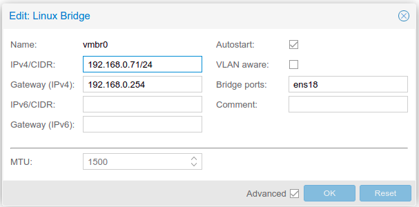

# Le réseau dans les hyperviseurs

Dans un environnement virtualisé, les machines — dans ce cas, virtuelles — doivent communiquer : soit entre elles, soit avec l'hôte physique soit encore, avec le réseau externe. La **connectivité** est virtuelle et doit être la plus **efficace** possible. Parfois, l'environnement nécessitera que les réseaux virtuels soient segmentés pour permettre une meilleure **isolation**.

Il existe deux techniques dont les détails diffèrent un peu en fonction de l'hyperviseur utilisé. 

## **NAT** (*network address translation*)

Seule l'adresse IP de l'hôte est utilisée et l'hyperviseur fournit la connectivité aux différentes _VM_. Seul l'hyperviseur est visible de l'extérieur. Les _vm_ sont invisibles. 

NAT est plus fréquent dans les environnements de test et avec des hyperviseurs de type 2 (_hosted_).

## **vSwitch** (*virtual switch*)

Un _vSwitch_ est un _switch_ (commutateur) logiciel simulant un _switch_ physique utilisé pour connecter les machines entre elles. 

Un _bridge_ (au sens linux) est la version linux du _vSwitch_. 

- KVM utilise `bridge-util` ou `openvswitch`
- Proxmox est une _surcouche_ à KVM et propose une interface web pour créer un bridge et l'associer à un VLAN
- ESXi utilise ses _vswitch_ propriétaires

### _vSwitches_ et VLANs

Ces _vSwiches_ supportent les VLANs. Par exemple `bridge-utils` :

```conf
auto vmbr1
iface vmbr1 inet manual
    bridge-ports nic0
    bridge-stp off
    bridge-fd 0
    bridge-vlan-aware yes
    bridge-vids 2-4094
```

ou pour Proxmox ;




:::tip 💡 À LIRE AUSSI
[Bridge linux](bridge.md)
:::

### Bonding (agrégation de liens)

Le _bonding_ Linux permet d'agréger plusieurs interfaces réseau physiques en une seule interface logique (comme `bond0`). Cette technique améliore la **bande passante** et/ou la **redondance**.

Configuration typique :

```conf
auto bond0
iface bond0 inet static
    address 192.168.1.10
    netmask 255.255.255.0
    bond-slaves eth0 eth1
    bond-mode balance-rr
    bond-miimon 100
```
- `bond-miimon` (_MII monitoring_) définit l'intervalle (ici 100 ms) de vérification des liens réseau pour la détection de panne par exemple.

Modes courants :
- `balance-rr` : répartition round-robin
- `active-backup` : redondance (un lien actif)
- `802.3ad` : LACP (agrégation dynamique)